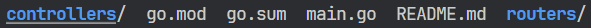

# 📚 Documentation


## Gin Framework

Gin Framework merupakan framework untuk membantu dalam pengerjaan http respon/request. Gin berbasis net/http bawaan dari Go Language, sehingga mudah digunakan dan lebih kompatibel dengan ekosistem Go Language.

Meng-Install Gin cukup menggunakan perintah di terminal :
```
go get -u github.com/gin-gonic/gin
```

note : Sebelum Meng-Install Gin diharapkan sudah menambahkan go.mod (Langkah)

Setelah selesai install Gin. Diharapkan meng-Importnya untuk mendukung dalam pembuatan Rest-API :

```
import (
    net/http
    github.com/gin-gonic/gin
)
```
Sebelum membuat Rest-API. Ada baiknya untuk membuat folder dan file terpisah, tujuan ini untuk mempermudah debuging dan keterbacaan code. Struktur yang harus diikuti sebagai berikut :


